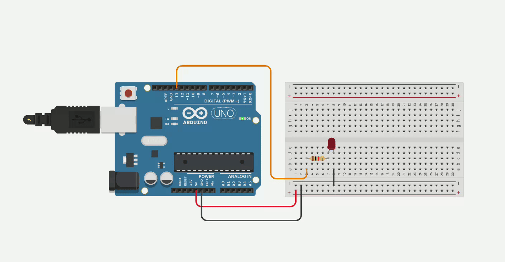

# Introdução à programação com Arduino


# Conceitos básicos de eletrônica

## Tensão elétrica

- A tensão elétrica, também conhecida como **diferença de potencial**, ou **voltagem**, é a diferença de potencial elétrico entre dois pontos. 
- Ela pode ser medida através de um **voltímetro** e sua unidade é o **Volt** (V). 
- Ela representa a tendência que uma carga tem para ir de um ponto a outro. Sem tensão elétrica, não há corrente.
## Corrente elétrica

- A corrente elétrica é o fluxo de partículas com carga elétrica dentro de um condutor.
- Há corrente quando há diferença de potencial.
- Pode ser medida por um **amperímetro** e sua unidade é o **Ampere** (A).
- Sua intensidade é medida pela quantidade de carga que passa por um intervalo de tempo.
- Pode ser **contínua** ou **alternada**.

### Corrente contínua

- A corrente elétrica contínua mantém sua intensidade constante ao longo do tempo.
- Tipicamente produzida por pilhas, baterias e fontes. 
![[Pasted image 20240108221140.png|300]]
### Corrente alternada

- Sua intensidade varia ao longo do tempo.
- Rede elétrica doméstica funciona com base em corrente alternada.

## Resistência

- A resistência elétrica é a capacidade que um corpo qualquer de se opor à passagem de **corrente elétrica**.
- É medida em **Ohms** $(\Omega)$

## Lei de Ohm

- Em termos gerais, a lei de Ohm afirma que a resistência ($R$) de um dispositivo condutor é dada pela razão da tensão elétrica ($V$) pela corrente ($A$):

$$ 
R = \frac{V}{I}
$$
- Podemos calcular a corrente de um circuito elétrico utilizando essa equivalência da seguinte forma:

$$
I = \frac{V}{R}
$$


## Circuitos Eletrônicos

- Um circuito eletrônico possui uma série de componentes eletrônicos para cumprir uma tarefa.
- Normalmente circuitos eletrônicos obtém entradas, através de **sensores**, processam essas entradas, e produzem uma saída.

### Dispositivos de entrada

- Dispositivos de entrada, inputs, ou sensores, tomam sinais do mundo físico e os convertem em corrente ou voltagem.
- Exemplos de sensores:
	- Sensor de gás;
	- Termômetro;
	- Fotocélulas;
	- Potenciômetros;
	- Sensor de presença;
	- Sensor de distância;
	- Sensor de umidade;
	- etc.

![[Pasted image 20240108222314.png|200]]

![[Pasted image 20240108222407.png|200]]

### Dispositivos de saída

- Dispositivos de saída convertem tensão elétrica ou corrente em sinais físicos.
- Exemplos de dispositivos de saída:
	- Motores elétricos;
	- LEDs;
	- Alarmes sonoros;
	- etc.

![[Pasted image 20240108222959.png|200]]
![[Pasted image 20240108223023.png|300]]

### Digital vs analógico

- Sinais digitais podem assumir um número finito de valores. Normalmente, utiliza-se um sistema binário para sinais digitais.
	- Verdadeiro ou falso;
	- 0 ou 1;
	- Com tensão ou sem tensão
- Sinais analógicos por sua vez podem tomar uma infinidade de valores.
- Exemplos de dispositivos que lidam com sinais digitais:
	- Botões, LEDs, etc...
- Exemplos de dispositivos que lidam com sinais analógicos:
	- Motores, potenciômetros, etc.

![[Pasted image 20240110193821.png]]

### Modulação por largura de pulso

- Modulação por largura de pulso, ou PWM é uma técnica de modulação utilizada para obter resultados analógicos através de meios digitais.
- Uma onda quadrada é gerada alternando os sinais de 0 e 1 com uma determinada frequência.
- Quanto maior a frequência, maior o suposto valor analógico.
![[Pasted image 20240110193721.png]]

### Microcontroladores

- Microcontroladores são utilizados para interpretar os sinais obtidos dos sensores e ativar determinadas ações nos dispositivos de saída.
- Eles executam a lógica do circuito.
![[Pasted image 20240108223205.png|300]]
### Protoboard

- As protoboards são placas reutilizáveis utilizadas para construção de circuitos eletrônicos sem solda.
![[Pasted image 20240108223850.png|300]]
- As primeiras e as últimas duas linhas possuem conexões horizontais.
- As demais colunas são conectadas verticalmente.
![[Pasted image 20240108224019.png|500]]
- Devemos nos atentar a essas conexões na hora de construir nossos protótipos.

### Resistores

- Resistores são dispositivos para limitar a passagem de corrente elétrica.
- Transforma energia elétrica em energia térmica (calor), fenômeno conhecido como **efeito Joule**.
- São muito utilizados em circuitos para que componentes não sejam *fritados*. 

![[Pasted image 20240108220237.png|300]]

![[Pasted image 20240108220447.png|300]]
- A resistência dos resistores normalmente é calculada de acordo com a seguinte tabela:

![[Pasted image 20240110155430.png]]

### LEDs

- LEDs são dispositivos que emitem luz visível.
- Muito utilizados em produtos eletrônicos para sinalizar avisos, como erros ou se o produto está em *standby* ou não.
- Podem ser encontrados em tamanhos pequenos ou grandes.
- Possuem uma vida útil longa e um baixo consumo de energia.
![[Pasted image 20240108234431.png|300]]
- Os LEDs possuem uma polaridade e, caso sejam conectados de forma invertida, não funcionarão corretamente.
- O ânodo corresponde ao polo positivo, enquanto o cátodo ao negativo.
- A "perna" maior corresponde ao ânodo (+), enquanto a menor corresponde ao cátodo.
- Outra forma de descobrir a polaridade é observar a base do LED. O lado que possuir um lado achatado, em vez de arredondado, é o cátodo (-). 

![[Pasted image 20240108234907.png|700]]
- LEDs também podem possuir componentes RGB  (Red, Green and Blue) e reproduzir várias cores. 
- Dentro da mesma estrutura existe um LED vermelho, um verde e um azul que, quando combinados, podem reproduzir milhares de cores diferentes.

### Botões

- Botões são utilizados para ativar, ou desativar alguma função do circuito. 
- Atua como uma espécie de interruptor, ativando, ou desativando uma determinada função.
- Tipicamente utilizados como dispositivos de entrada.

![[Pasted image 20240108235304.png|300]]

### Sensor de luminosidade

- Sensores de luminosidade (LDRs) são resistências de valor variável.
- A resistência varia de maneira inversamente proporcional à incidência de luz.
- Baixa luminosidade -> alta resistência
- Alta luminosidade -> baixa resistência

![[Pasted image 20240110161705.png|300]]

### Sensores piezoelétricos
- Sensores piezoelétricos são capazes de converter mudanças de pressão em sinais elétricos ou vice-versa.
- Podem ser utilizadas para converter corrente em som, por exemplo, ou vice-versa.

![[Pasted image 20240110162101.png|300]]
### Potenciômetros

- Potenciômetros são resistências de valor variável. 
- Pode-se regular a intensidade de corrente ou voltagem que passa por um potenciômetro.
- Um exemplo clássico de potenciômetro é o botão de volume em um rádio ou uma guitarra.

![[Pasted image 20240110155710.png|300]]

### Display LCD

- Um display LCD é um painel para exibir informações como textos, imagens ou vídeos por meio da eletrônica.
- Tipicamente utilizados como dispositivos de saída.
![[Pasted image 20240110162402.png|200]]

### Motores CC

- Um motor de corrente contínua (CC) converte energia elétrica em energia mecânica.
- A velocidade dele é facilmente controlável.
- Encontrado em brinquedos, robôs, etc.

![[Pasted image 20240110162811.png|300]]

##  Arduino

- O projeto Arduino foi criado com intuito de oferecer aos estudantes a possibilidade de construir projetos de circuitos integrados de maneira barata.
- Neste curso utilizaremos o microcontrolador Arduino Uno R3 para desenvolvimento dos projetos.


### Disposição de pinos

![[Pasted image 20240110162940.png|700]]


![[Pasted image 20240110164629.png]]
#### Entrada e saída 

- O Arduino possui diversas entradas e saídas digitais e analógicas. Ao todo são:
	- 14 pinos digitais.
	- 6 pinos analógicos.
- Os pinos analógicos são utilizados para captar dados dos sensores analógicos, como medidores de umidade ou temperatura e convertê-los em um sinal digital de 10 bits, portanto os valores obtíveis desses pinos variam de 0 a 1023.
- Os pinos digitais, por outro lado, podem assumir valores de 0 ou 1 (HIGH ou LOW), que representam tensão 0V ou 5V. Podem ser utilizados tanto para entrada quanto para saída.

#### Alimentação

- Existem pinos de 5V, 3.3V e terra, para prover alimentação aos componentes eletrônicos.
- O Arduino, por sua vez, pode ser alimentado:
	- Através de um cabo USB AB.
	- Através do conector fêmea (12 no diagrama).
	- Através do pino $V_{in}$ e de uma bateria.
		
#### PWM

- Através dos pinos 3, 5, 6, 9, 10 e 11, é possível aplicar a técnica de PWM.

### Comunicação serial

- A comunicação serial do Arduino é uma interface que permite o envio de informações um bit de cada vez (serialmente).
- Permite que nos comuniquemos com um computador.
- Tudo por meio da **porta serial**.

## Tinkercad

- A plataforma Thinkercad permite prototipar circuitos digitais com o microcontrolador Arduino R3.
- É possível desenhar circuitos com lógicas complexas sem necessariamente ter o hardware em mãos.
- Muito útil para aprender programação e introdução a eletrônica.
- A plataforma pode ser acessada em [https://www.tinkercad.com/](https://www.tinkercad.com/)

### Criação de protótipos

- Para criar um protótipo, basta clicar em Designs -> Create -> Circuit.
![Criação de um protótipo][recursos/criacao-prototipo.gif]


# Programação 

- O Arduino utiliza um dialeto da linguagem de programação `C++` para controlar os dispositivos.
- Programas são escritos diretamente em um arquivo texto, compilados e transferidos para a execução no Arduino.
- Para começar a entender programas em Arduino, é necessário entender que um programa possui dois blocos de código, chamados de funções, básicos, `setup`e `loop`.
	- `setup`: contém todas as instruções que serão executadas antes do `loop`.
	- `loop`: as instruções contidas aqui serão executadas indefinidamente de maneira cíclica. Afinal, um microcontrolador não deveria parar a sua execução. 
- Exemplo básico de programa em Arduino que pisca um LED de $1000$ em $1000$ milissegundos.

```cpp
const int pino_led = 13; // pino 13 será utilizado para ligar e desligar o LED

void setup(){
	pinMode(pino_led,OUTPUT);
}

void loop(){
	digitalWrite(pino_led,HIGH);
	delay(1000);
	digitalWrite(pino_led,LOW);
	delay(1000);
}
```

- O programa faz o seguinte:
	- Em `setup`, atribuímos ao pino $13$ a variável `led_pin` no modo de saída (OUTPUT). Ou seja, esse pino será utilizado para enviar sinais a um dispositivo de saída.
	- Em `loop`: 
		- Enviamos o sinal `HIGH` a partir do pino $13$.
		- Esperamos um segundo através da instrução `delay(1000)`;
		- Enviamos o sinal `LOW`a partir do pino $13$.
		- Esperamos mais um segundo.
	- Após a última instrução de `loop`, voltamos ao início (realmente é um `loop`).

- O circuito resultante é o seguinte:

## Comentários

- Comentários permitem que o código seja documento para facilitar a sua leitura.
- São instruções completamente ignoradas pelo compilador, só fazem sentido ao programador.
- São muito úteis para que outras pessoas (e até você mesmo) entendam o seu código.
- Comentários são feitos após colocar texto após os caracteres `//`
- Exemplo:
```cpp
const int pino_led = 13; // pino 13 será utilizado para ligar e desligar o LED
```
## Variáveis

- Variáveis são nomes para endereços de memória.
- Podemos armazenar valores em memórias através do nome de uma variável.
- Variáveis podem assumir diferentes tipos, como caracteres, inteiros, reais, entre outros.

![[Pasted image 20240111153857.png|500]]

### Tipos de variáveis

- Trabalharemos com os seguintes tipos de variável nesse curso:
	- `char`: caractere, armazena um caractere. 
	- `bool`: booleano, armazena `true` (verdadeiro) ou `false` (falso).
	- `byte`: armazena inteiros sem sinal de 8-bits na faixa $[0,255]$.
	- `int`: armazena inteiros de 16-bits na faixa $[-32768,32767]$.
	- `float`: armazena números reais usando representação em ponto flutuante de precisão simples da ordem de $-10^{38}$ à $10^{38}$.
	- `double`: armazena números reais usando representação em ponto flutuante de precisão dupla.
- Variáveis precisam ser declaradas para serem utilizadas. Para declarar variáveis utilizamos a seguinte sintaxe:
	- `<tipo> nome_da_variavel`; 
- Exemplos:
	- `int x;`
	- `byte pino_led`;
	- `double nota;`
	- `bool condicao`;
- É importante que os nomes das variáveis não possuam espaços e nem caracteres especiais.
- Variáveis de mesmo nome também não podem ser declaradas duas vezes no mesmo escopo.
- Variáveis com o modificador `const` são utilizadas para representar constantes. Seu valor não pode ser alterado.

## Operadores aritméticos

- É possível fazer operações aritméticas entre variáveis utilizando o Arduino.
- As seguintes operações são suportadas:

| Operador |   Significado  |
|:--------:|:--------------:|
| =        | Atribuição    |
| +        | Soma           |
| -        | Subtração     |
| *        | Multiplicação |
| /        | Divisão       |
| %        | Resto          |


### Atribuição

- Permite que variáveis assumam valores ou resultados de expressões aritméticas.
- Exemplos:
```cpp
a = 5; // a recebe o valor 5
a = b + c; // a recebe o valor da soma das variáveis b e c.
```

### Soma

- O operador `+` realiza soma de valores e variáveis.
- Exemplo:
```cpp
int a = 5;
int b = 10;
int c = 0;
c = a + b;  // a variável c receberá o valor 15
```

### Subtração

- O operador `-`realiza a subtração de valores e variáveis.
- Exemplos:
```cpp
int a = 5;
int b = 10;
int c = 0;
c = a - b;  // a variável c receberá -5
```

```cpp
float a = 5.5;
float b = 6.6;
float c = 0;
c = a - b;  // a variável c receberá -1.1
```

### Multiplicação
- O operador `*` realiza a multiplicação entre valores e variáveis.
- Exemplos:

```cpp
int a = 5;
int b = 10;
int c = 0;
c = a * b;  // a variável c receberá 50
```

```cpp
float a = 5.5;
float b = 6.6;
float c = 0;
c = a * b;  // a variável c receberá 36.3
```
### Divisão

- O operador `/` realiza a divisão entre valores e variáveis.
- O denominador deve ser diferente de $0$ para evitar erros.
- Exemplos:
```cpp
int a = 50;
int b = 10;
int c = 0;
c = a / b;  // a variável c receberá o valor 5
```

```cpp
float a = 55.5;
float b = 6.6;
float c = 0;
c = a / b;  // a variável c receberá o valor 8.409
```

- **Importante**: caso o numerador e o denominador sejam *inteiros* , será efetuada uma divisão inteira, isto é, a parte fracionária é desprezada.
- Exemplo: `5/2 = 2`.
- Use isso ao seu favor.
### Resto 

- O operador `%` é capaz de extrair o resto da divisão de dois números.
- Só é aplicável quando os operandos são inteiros.
```cpp
int x = 0;
x = 7 % 5;  // x recebe 2
x = 9 % 5;  // x recebe 4
x = 5 % 5;  // x recebe 0
x = 4 % 5;  // x recebe 4
x = -4 % 5; // x recebe -4
x = 4 % -5; // x recebe 4
```

## Comunicação serial

- Através da comunicação serial é possível obter dados e enviar dados.
- Para utilizar a comunicação serial, é necessário inicializá-la via `setup`
```cpp
void setup() {
    Serial.begin(9600); 
}
```
### Saída 

- Para enviar o valor de uma variável `x`à porta serial, usamos o comando `Serial.print(x)`.
- Se quisermos pular uma linha após a impressão, podemos usar o comando `Serial.println(x)`.

### Leitura de inteiros

- Para ler inteiros via comunicação serial, precisamos de três pequenos passos.
1. Iniciar a comunicação serial no `setup`
2. Criar a função ler_inteiro abaixo:
```cpp
int le_inteiro(){
  	int x;
    while(Serial.available() == 0)
    {}
    x = Serial.parseInt();
  	return x;
}
```
3. Chamar a função `le_inteiro() quando apropriado.

**Exemplo**

- O programa abaixo lê dois inteiros e imprime a soma deles na comunicação serial.

```cpp
int le_inteiro(){
  	int x;
    while(Serial.available() == 0)
    {}
    x = Serial.parseInt();
  	return x;
}


void setup(){
	Serial.begin(9600);
}

void loop(){
	int x = le_inteiro();
	int y = le_inteiro();
  	Serial.println(x+y);
}
```

### Leitura de números reais

- O processo é muito parecido ao dos números inteiros, mas com a função `le_real` abaixo.
**Exemplo**

- O programa abaixo lê dois números reais e imprime a soma deles na comunicação serial.
```cpp

int le_inteiro(){
  	int x;
    while(Serial.available() == 0)
    {}
    x = Serial.parseInt();
  	return x;
}

float le_real(){
	float x;
    while(Serial.available() == 0)
    {}
    x = Serial.parseFloat();
  	return x;
}

void setup(){
	Serial.begin(9600);
}

void loop(){
	float x = le_real();
	float y = le_real();
  	Serial.println(x+y);
}
```


### Exercícios 

1. Crie um programa que leia três números reais  e imprima a média aritmética deles via comunicação serial.
	-  Por exemplo, se os números lidos forem $5.5$, $6.0$ e $7.5$, a média que será impressa é $6.33333$
2. Leia um número real, contendo o valor de uma temperatura em Fahrenheit, converta para Celsius, e imprima o resultado via comunicação serial. Por exemplo:
	- $32$ Fahrenheits é igual a $0$ Celsius.
	- $50$ Fahrenheits é igual a -10 Celsius
	- $100$ Fahrenheit é igual a $37.7778$ Celsius.
3. Leia um número real, contendo o valor de uma temperatura em Celsius, converta para Fahrenheit, e imprima o resultado via comunicação serial.
4. Crie um programa que leia um inteiro, representando uma quantidade em segundos, converta e imprima essa quantidade no formato hora, minuto e segundo, via comunicação serial. Por exemplo:
	-  $39323$ segundos equivale à $10$ horas, $55$ minutos e $23$ segundos.
5. Crie um programa que leia três números reais indicando o comprimento dos lados de um triângulo, calcule a sua área, e imprima o resultado via comunicação serial.
	- Utilize a fórmula de Heron para calcular a área do triângulo: $\sqrt{p \cdot (p-a) \cdot (p-b) \cdot (p-c)}$ , em que $p = \frac{a+b+c}{2}$ .
	- A função `sqrt` pode ser utilizada para calcular a raiz de um número. Exemplo `sqrt(2)` $= 1.4142135623\ldots$  


## Entrada e saída

- Através dos pinos do Arduino é possível ler e enviar sinais digitais e analógicos.
- Veremos agora as funções que trabalham com entrada e saída digital e analógica.
#### Atribuição dos pinos

- Antes de poder usar os pinos, é necessário atribuir a função deles.
- Para isso, usamos a função `pinMode()` que deve ser colocada no `setup()`.
- Ela recebe o número do pino e se ele será um pino de entrada ou saída. Exemplo:
```cpp
pinMode(9,OUTPUT);
```
- No exemplo acima, o pino $9$ é configurado como saída, isto é, ele enviará um sinal para um dispositivo.
- Pinos de entrada recebem sinais dos sensores enquanto pinos de saída enviam dados para os dispositivos de saída.
- Os pinos de $0$ a $13$ podem ser utilizados tando para entrada **digital** (INPUT) como saída **digital** (OUTPUT).
- Os pinos $3$, $5$, $6$, $9$, $10$ e $11$ são PWM, logo, podem enviar sinais analógicos modulados a partir da técnica de PWM para dispositivos de saída analógicos.
- Os pinos $A0$, $A1$, $A2$, $A3$, $A4$ e $A5$ recebem apenas entradas analógicas.

### Entrada e saída digital

#### Entrada digital

- A função `digitalRead()` lê o valor de um pino digital e devolve `HIGH` (1) ou `LOW` (0), de acordo com a lógica Booleana. O exemplo abaixo diz se um botão foi pressionado ou não.

![[recursos/le-botao.png]]

```cpp
const int pino_botao = 2;

void setup() {
  Serial.begin(9600);
  pinMode(pino_botao, INPUT);
}

void loop() {
	int valor_botao = digitalRead(pino_botao);
  	Serial.print("O valor do botao e: ");
  	Serial.println(valor_botao);
  	delay(100);
}
```

- Se o botão não for pressionado, não há conexão entre os dois lados do botão, realizando uma leitura `LOW`.
- Quando o botão é pressionado, o circuito fecha, fazendo a leitura do valor `HIGH`.

**Exercício**

- Modifique o circuito anterior para ligar um LED quando o botão for pressionado.

#### Saída digital

- A função `digitalWrite()` escreve um valor `HIGH` ou `LOW`a partir de um pino digital.
- Exemplo: `digitalWrite(3,HIGH)` escreve o valor `HIGH` a partir do pino `3`.
- O exemplo inicial do pisca-led ilustra a função `digitalWrite`.

**Exercício**

- Projete um circuito que lida com um pequeno semáforo. Ele deverá possui três LEDs das cores vermelho, amarelo e verde. O LED vermelho deverá ficar ligado por 30 segundos, o amarelo por 3 e o verde por 10. O LED verde só liga após o vermelho desligar, o amarelo só liga após o verde desligar e o vermelho só liga após o amarelo desligar. O primeiro LED a ser ligado deverá ser o vermelho.

### Entrada analógica

- A entrada analógica é realizada nos pinos de $A0$ a $A5$. 
- Os valores lidos possuem $10$ bits, logo, estão entre $0$ e $1023$.
- O circuito abaixo realiza a leitura a partir de um potenciômetro e imprime o valor lido via comunicação serial.

![[leitura-analogica-potenciometro.png]]

```cpp
const int pino_potenciometro = A5;

void setup() {
  Serial.begin(9600);
  pinMode(pino_potenciometro,INPUT);
}

void loop(){
	int valor_potenciometro = analogRead(pino_potenciometro);
  	Serial.print("Valor lido: ");
  	Serial.println(valor_potenciometro);
}
```


**Exercícios**

- Converta a saída do potenciômetro para a voltagem correspondente, isto é, de $0$V a $5$V.
### Saída analógica

- A saída analógica é feita através dos pinos digitais PWM.
- O comando a ser utilizado é o `analogWrite`.
- O circuito abaixo acende um LED de acordo com o valor do potenciômetro, quanto maior o valor da saída do potenciômetro, mais brilho terá o LED.
![[escrita-analogica-potenciometro.png]]

```cpp
const int pino_potenciometro = A5;
const int pino_pwm = 3;

void setup() {
	Serial.begin(9600);
	pinMode(pino_potenciometro,INPUT);
  	pinMode(pino_pwm,OUTPUT);
  
}

void loop(){
	int valor_potenciometro = analogRead(pino_potenciometro);
  	Serial.print("Valor lido: ");
  	Serial.println(valor_potenciometro);
  	valor_potenciometro = map(valor_potenciometro, 0, 1023, 0, 255);
  	Serial.print("Valor convertido: ");
  	Serial.println(valor_potenciometro);
	analogWrite(pino_pwm,valor_potenciometro);
  	delay(100);
}
```

- O valor analógico lido tem $10$ bits, portanto varia de $0$ a $1023$.
- Contudo, o pino PWM deve emitir valores de $8$ bits, variando de $0$ a $255$.
- Utilizamos o comando `map` para fazer o mapeamento de um valor de 10-bits para um valor de 8-bits.

**Exercícios**

1. Utilize três potenciômetros para regular a cor de um LED RGB. Cada potenciômetro ficará responsável por um componente de cor (Red, Green ou Blue).
2. Ligue o potenciômetro a um motor elétrico, fazendo ele girar de acordo com o valor do potenciômetro.

## Estruturas condicionais

- Imagine o seguinte problema: queremos projetar um circuito lê um inteiro da porta serial e acende um LED verde se ele for par e um vermelho se ele for ímpar.
- O nosso código tem que ter a capacidade de executar instruções diferentes, dependendo se o número for par ou ímpar.
- Através das estruturas condicionais, podemos controlar o fluxo de um programa.
- Podemos decidir executar um pedaço de código ou não baseado em uma condição ser verdadeira ou falsa.
- Para isso, utilizamos os operadores e conectivos lógicos.

### Operadores lógicos

- Expressões lógicas em `C++` só possuem dois tipos de valores: verdadeiro (1, HIGH) ou falso (0, LOW).
- Para construir uma expressão lógica, utilizamos os operadores lógicos, que estão listados abaixo.

| Operador |   Significado  |
|:--------:|:--------------:|
| ==       | Igualdade     |
| !=       | Diferença      |
| >        | Maior          |
| >=       | Maior ou igual |
| <        | Menor          |
| <=       | Menor ou igual |

#### Igualdade

- O operador `==`compara os dois lados da igualdade e retorna verdadeiro se são iguais e falso caso contrário.
- Não confunda o operador `==`de igualdade com o `=` para atribuir valores às variáveis.
- Exemplos:
```cpp
9 == 9 // retorna 1 (verdadeiro)
0 == 5 // retorna 0 (falso)
2 + 3 == 1 + 4 // Retorna verdadeiro ou falso?
```

```cpp
int a = 2; 
int b = 3;
int c = 1;
int d = 4;
a + c == b + d // Retorna verdadeiro ou falso?
```

#### Diferença

- O operador `!=` é o operador de diferença. Ele compara os dois lados e retorna 1 se são **diferentes** e 0 caso contrário.
- Exemplos:
```cpp
9 != 9 // retorna 0 (falso)
0 != 5 // retorna 1 (verdadeiro)
```

```cpp
int a = 2; 
int b = 3;
int c = 1;
int d = 4;
a + c == b + d // Retorna verdadeiro ou falso?
```

#### Maior

- O operador `>`,quando aplicado sobre duas expressões, retorna 1 se o que está à esquerda do operador é maior do que está à direita e 0 caso contrário.
- Exemplos:

```cpp
9 > 9 // retorna 0
5 > 0 // retorna 1
```

#### Maior ou Igual

- O operador `>=`, quando aplicado sobre duas expressões, retorna 1 se o que está a esquerda do operador é maior do que o que está à direita e 0 caso contrário.
- Exemplos:
```cpp
9 >= 9 // retorna 1
0 >= 5 // retorna 0;
```
#### Menor

- O operador `<`, quando aplicado sobre duas expressões, retorna 1, se o que está à esquerda é menor do que o que está à direita.
- Exemplos:
```cpp
9 < 9 // retorna 0
0 < 5 // retorna 1
```

#### Menor ou igual

- O operador `<=`, quando aplicado sobre duas expressões, retorna 1 se o que está à esquerda é menor ou igual do que o que está à direita.
- Exemplos:
```cpp
9 <= 9 // retorna 1
5 <= 0 // retorna 0
```

### Conectivos lógicos

- Para compor expressões lógicas mais complexas, podemos juntar duas expressões lógicas através de um **conectivo** lógico.
- São três os conectivos lógicos, o **NÃO** (`!`), o **E** (`&&`)e o **OU** (`||`).

#### Conectivo NÃO

- O conectivo NÃO (`!`) inverte o resultado de uma expressão lógica.
- Se uma expressão `e` for verdadeira, `!e` será falsa. Se `e`for falsa, `!e` será verdadeira, conforme a tabela verdade abaixo.
- É um operador **unário**, só atua sobre uma única expressão.

| `e` | `!e` |
| :--: | :--: |
| 0 | 1 |
| 1 | 0 |


#### Conectivo E

- O conectivo **E** (`&&`) é **binário**, atua sobre duas expressões `e1` e `e2`.
- Retorna verdadeiro apenas quando as duas são verdadeiras.
- Se pelo menos uma delas é falsa, `e1 && e2` devolve falso.

| `e1` | `e2` | `e1 && e2` |
| :--: | :--: | ---- |
| 0 | 0 | 0 |
| 0 | 1 | 0 |
| 1 | 0 | 0 |
| 1 | 1 | 1 |


#### Conectivo OU
- O conectivo **OU** (`||`) é **binário**, atua sobre duas expressões `e1` e `e2`.
- Retorna verdadeiro apenas quando pelo menos uma das expressões é verdadeira.
- Se as duas expressões são falsas, `e1 || e2` devolve falso.

| `e1` | `e2` | e1 \| \| e2 |
| :--: | :--: | ---- |
| 0 | 0 | 0 |
| 0 | 1 | 1 |
| 1 | 0 | 1 |
| 1 | 1 | 1 |
#### Exemplos

- Uma expressão que avalia se uma variável `x`é par:
```cpp
x % 2 == 0
```
-  Uma expressão que avalia se uma variável `x`é ímpar: 
```cpp
!(x % 2 == 0)
```
-  Uma expressão que avalia se uma variável `x`é maior que 50 e menor que 100: 
```cpp
x > 50 && x < 100
```

-  Uma expressão que avalia se uma variável é divisível por 3, mas não é divisível por 5
```cpp
(x % 3 == 0) && (x % 5 != 0)
```

-  Uma expressão que avalia se uma variável `x`é ímpar: 
```cpp
!(x % 2 == 0)
```
### Se Então

- A estrutura Se, então, verifica o valor de uma expressão e, **se ela for verdadeira**, executa o bloco de código relacionado à estrutura.
- Sintaxe:
```cpp
if(condicao){
	// inserir codigo a ser executado aqui
	// caso a condição seja verdadeira
}
// O programa continua a executar a partir daqui
```
- O programa retoma o seu fluxo normal depois do bloco de código. 
**Exemplo**

- Tome o seguinte problema: o usuário deverá digitar um inteiro via comunicação serial e o circuito acenderá um LED vermelho por um segundo se o inteiro for par.

![[Pasted image 20240117010901.png]]

```cpp
const int pino_led = 2;

int le_inteiro(){
    int x;
    while(Serial.available() == 0)
    {}
    x = Serial.parseInt();
    return x;
}

void setup()
{
  Serial.begin(9600);
  pinMode(pino_led,OUTPUT);
}

void loop()
{
  int x = le_inteiro();
  digitalWrite(pino_led,LOW);
  if(x % 2 == 0){
    digitalWrite(pino_led,HIGH);
    delay(1000);
  }  
}
```

**Exemplo**

- Agora tome o seguinte problema: construir um circuito que que verifique se existe partículas de gás no ar e acione um alarme caso positivo.
- Para isso precisaremos do sensor de gás e de um dispositivo piezoelétrico, que produzirá o som.
![[Pasted image 20240117015708.png]]

```cpp
const int sensor_gas = A0;
const int alarme = 2;
void setup()
{
  Serial.begin(9600);
  pinMode(sensor_gas,INPUT);
}

void loop()
{
	int valor_gas = analogRead(sensor_gas);
  	Serial.println("valor_gas: ");
  	Serial.println(valor_gas);
  	if(valor_gas >= 250){
    	tone(alarme,400,3000);
    }
}
```
- O gás é ser lido através de um pino analógico. Já o alarme é acionado através de um pino digital.
- Se o sensor acusa uma concentração de gás superior ou igual a 250, acionamos o alarme a uma frequência de 400Hz por 3 segundos através do comando `tone`.
### Senão

- E se quiséssemos que  o programa executasse uma lógica se a condição fosse verdadeira e outra se fosse falsa?
- Para isso temos o **senão** .
- Sintaxe:
```cpp

if(condicao){
	// Comandos que serão executados se a condição for verdadeira
}
else{
	// comandos que serão executados se a condição for falsa
}
// o programa continua aqui após executar um dos blocos de código acima.
```

**Exemplo**
- Vamos tomar o problema anterior de verificar se um lido via comunicação serial é par. Mas desta vez acenderemos um LED verde se ele for par e um LED vermelho se ele for ímpar. Os LEDs deverão ficar ligados por 1 segundo.

![[Pasted image 20240117021800.png]]

```cpp
const int pino_verde = 2;
const int pino_vermelho = 4;

int le_inteiro(){
    int x;
    while(Serial.available() == 0)
    {}
    x = Serial.parseInt();
    return x;
}

void setup(){
  Serial.begin(9600);
  pinMode(pino_verde,OUTPUT);
  pinMode(pino_vermelho,OUTPUT);
}

void loop(){
  int x = le_inteiro();
  if(x % 2 == 0){
    	digitalWrite(pino_verde,HIGH);
    	delay(1000);
    	digitalWrite(pino_verde,LOW);
  }
  else{
    	digitalWrite(pino_vermelho,HIGH);
    	delay(1000);
    	digitalWrite(pino_vermelho,LOW);
  }
}
```
### Exercícios
1. Faça um circuito que mantenha um LED aceso quando um botão é pressionado e o apague quando ele é pressionado novamente.
2. Faça um circuito que acenda um LED apenas quando dois botões são pressionados.
3. Elabore um circuito que ligue uma lâmpada caso o sensor de presença detecte movimento.
4. Faça um circuito que receba um inteiro via comunicação serial e acenda um LED verde se ele for par e vermelho se ele for ímpar. Os LEDs devem ficar ligados por apenas 1 segundo.

## Estruturas de repetição

